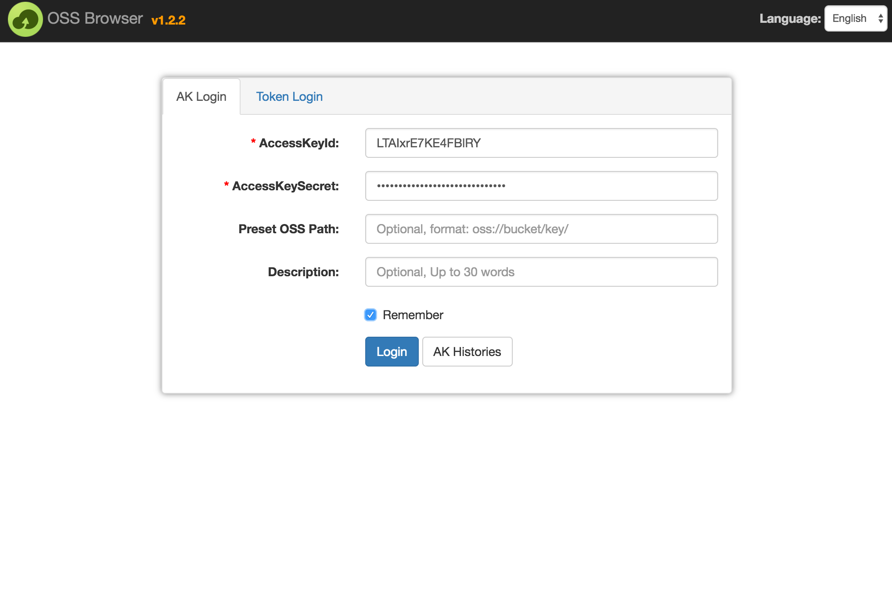
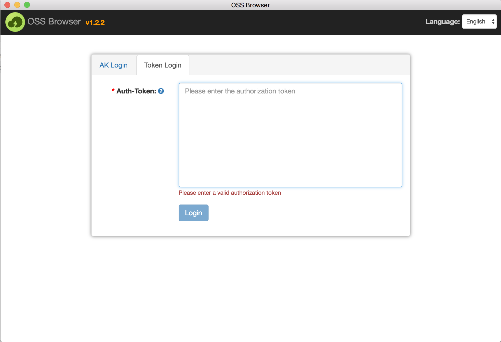
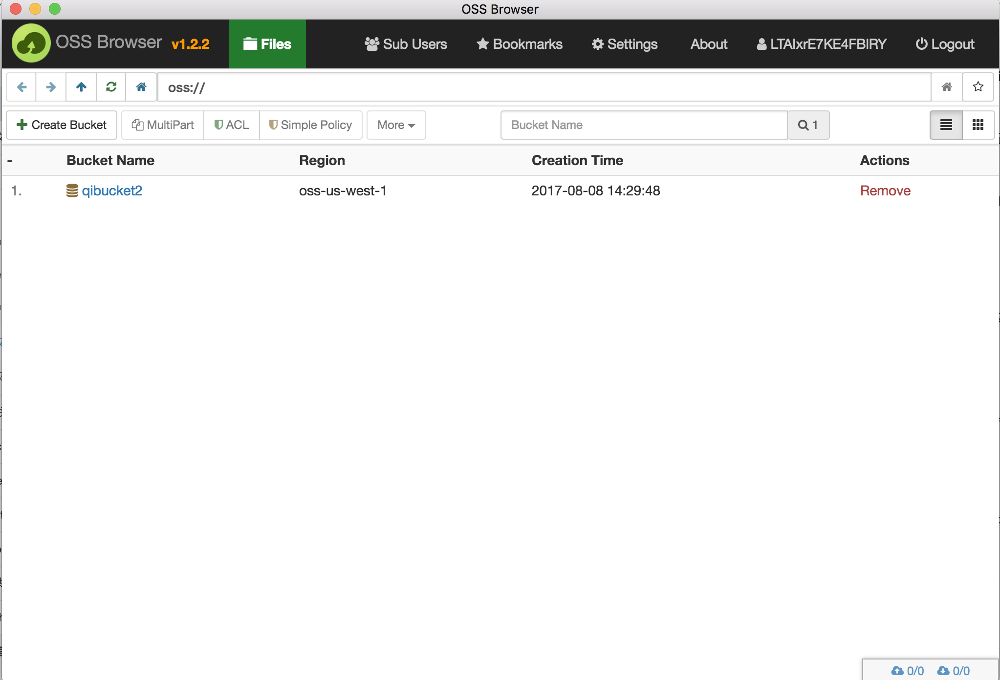
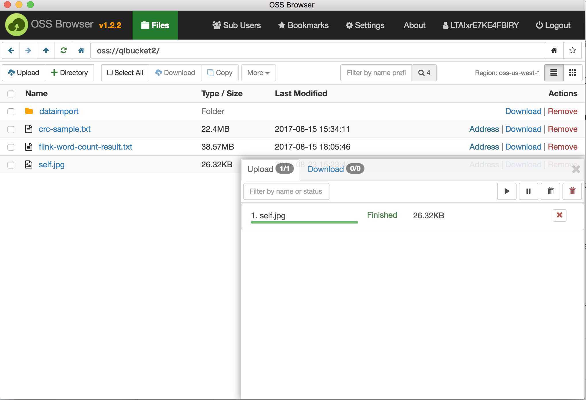
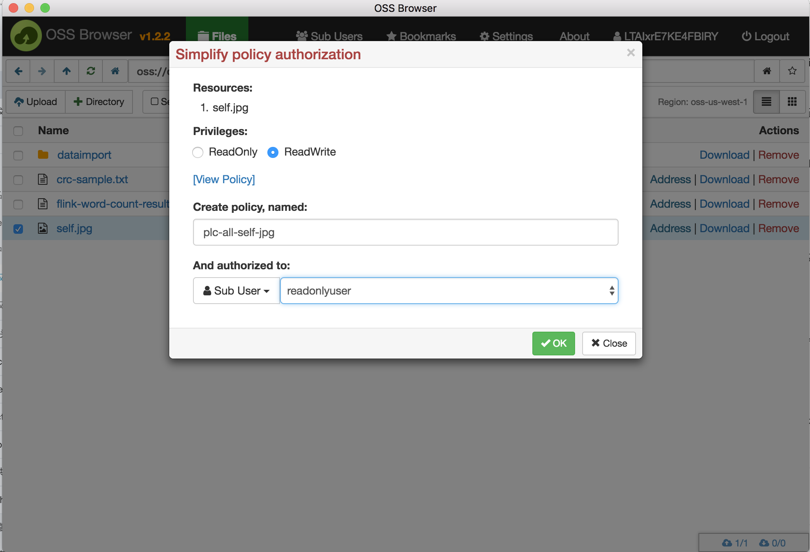
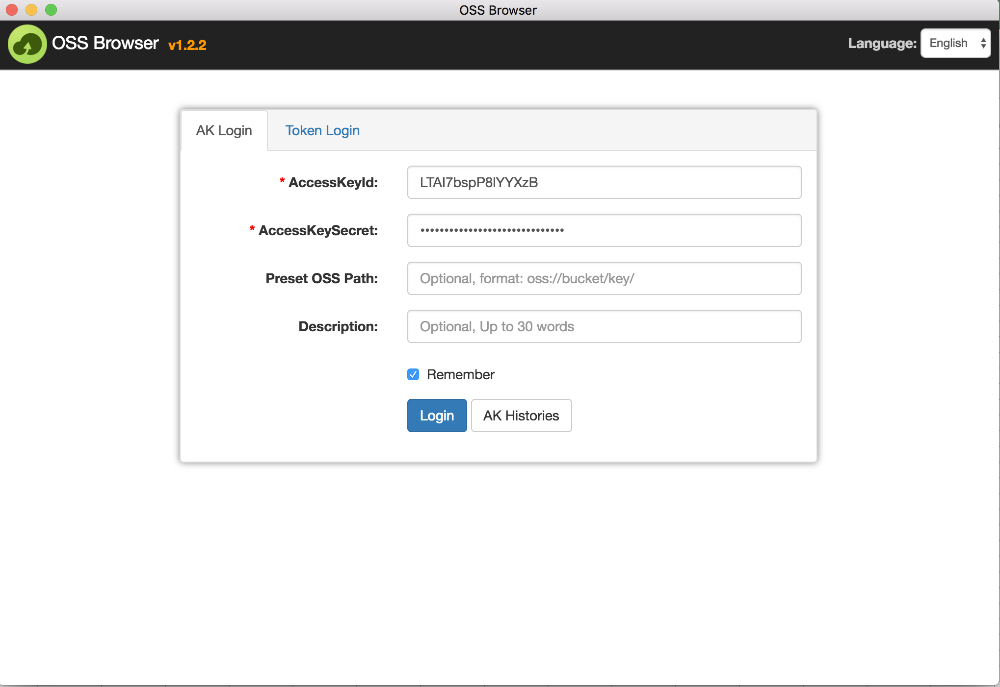
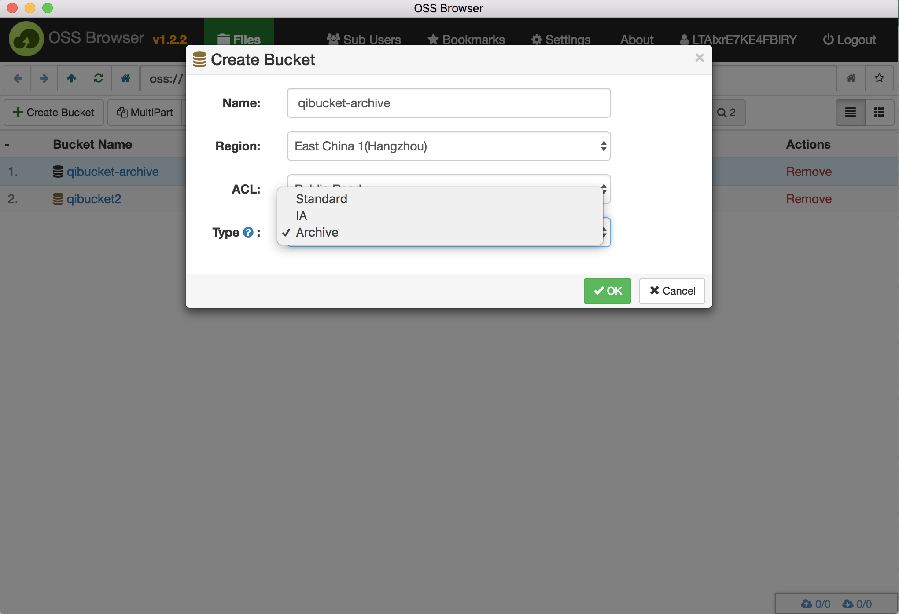
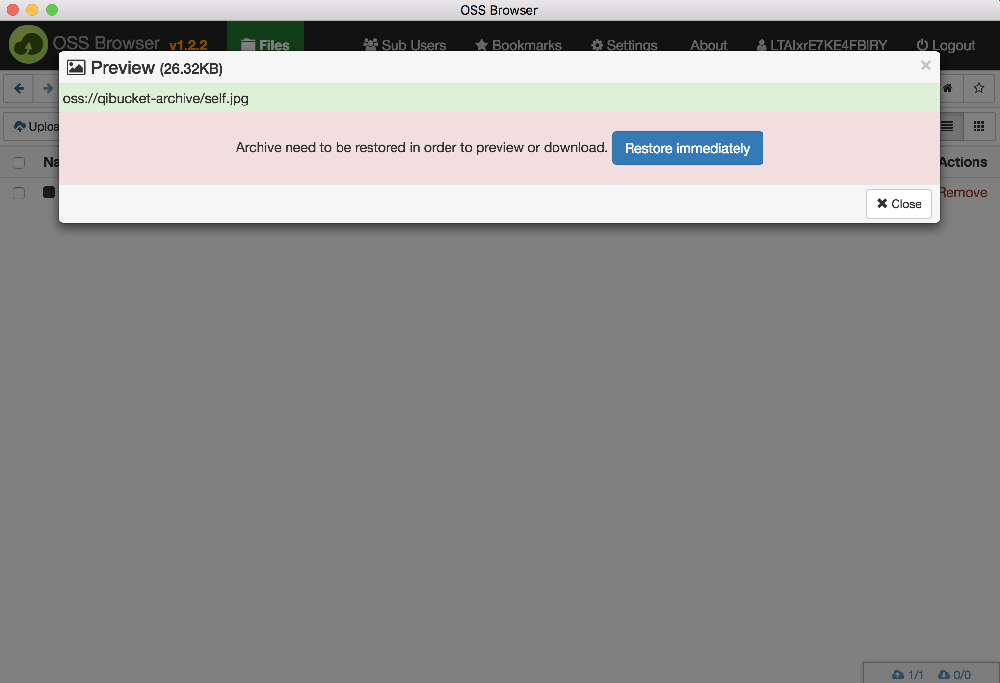

# OSS Browser

OSS Browser provides the similar functionality of Windows Resource Manager, which could enable user browse files, upload or download files with resumable upload/download support,etc.

The tool is based on Angular 1.x + [Electron](http://electron.atom.io/).

> Electron framework could enable you develop desktop apps with Javascript, Html and CSS. And it's bsaed on nodejs and Chromium. Electron could generate package running on Mac, Windows and Linux.


## 1. Binary Download：

Latest version`1.2.2`, below are the download addresses. Just download and unzip, and you're ready to go!

> [<h4>Window x64 Download</h4>](http://luogc.oss-cn-hangzhou.aliyuncs.com/oss-browser-publish/1.2.2/oss-browser-win32-x64.zip)

> [<h4>Mac Download</h4>](http://luogc.oss-cn-hangzhou.aliyuncs.com/oss-browser-publish/1.2.2/oss-browser.dmg)

> [<h4>Ubuntu x64 Download</h4>](http://luogc.oss-cn-hangzhou.aliyuncs.com/oss-browser-publish/1.2.2/oss-browser-linux-x64.zip)

For other versions, please build from the source code if you need it.


> [Previous version Download](all-releases.md)


## 2. Features introduction:

```
Features Map
  |-- Login：Just need AK。
  |-- Bucket Management，Create bucket，Delete bucket，bucket permission update，multipart management.
       |-- File Management：Folder（Includes bucket） and file CRUD, copy and file preview.
             |-- File Transfer Task Management： Resumable file upload or download.
  |-- Address Bar: Supports oss://protocol URL, brwose history, forward, back, bookmarks.
  |-- Permission Management: Simplify the RAM permission assignment.
```

Unique Features

1. Address bar：Supports oss://protocol URL, brwose history, forward, back, bookmarks.

2. File preview and edit: Support previewing image file and editting text file. 


### (1) Login with AccessKeyId and Access Key Secret



* Sub user login could specify the OSS path together with the auth-token.



* Token Login.


### (2) Bucket List




### (3) File List (support drag and drop)



### (4) Permission Grant to sub users and sub users login





### (5) Support Archieve Bucket





* The storage class of files under "Archive bucket" is archieve. Restore is required before the access.


## 3. Dev environment setup

> If you want to develop based on it, please follow the following instructions.


### (1) Install latest version of node.js

Official Site: https://nodejs.org/

### (2) Install cnpm (optional, for Chinese dev only)

Official Site: https://cnpmjs.org/

cnpm is npm's China mirror, which could increase the download speed on dependency packages for Chinese users.

### (3) In windows, you need to intall windows-build-tools

```
npm i -g windows-build-tools
or 
cnpm i -g windows-build-tools
```

### (3) Dowload source code

```
git clone git@github.com:aliyun/oss-browser.git
```

Install dependencies:

```
npm i
or
cnpm i
```


### (4) Run

```
npm run dev  # run at dev mode. type command+option+i to launch debug UI, win or linux uses F12.
```

Under dev mode，the source code update is monitored and it will trigger auto build and update the dist directory.


### (5) Package

```
npm run build  # build frontend code to dist directory
```

```
npm run win64  # Package Win64 apps, you could specify other platform such as mac, linux64 etc.
```


## 4. Code Structure


```
oss-browser/
 |-- app/                 # Frontend code, uses angular1.x + bootstrap3.x
 |-- node/                # The node module called by Frontend code
     |-- crc64/           # crc checksum module, for checking file integrity.
     |-- ossstore/        # Upload Download job classes
     |-- i18n/            # globalization
 |-- vendor/              # Frontend aliyun-sdk dependency
 |-- node_modules         # node's dependent modules
 |-- dist                 # Frontend's dist directory
 |-- build                # electron build directory
 |-- gulpfile.js          # project management file
 |-- package.json         # project description file
```


## 5. About Contribute

* Currently we do not encourage code contribution. If you have suggests or find bugs, please open an issue to us. 

## 6. Open Source LICENSE

[Apache License 2.0](LICENSE)
